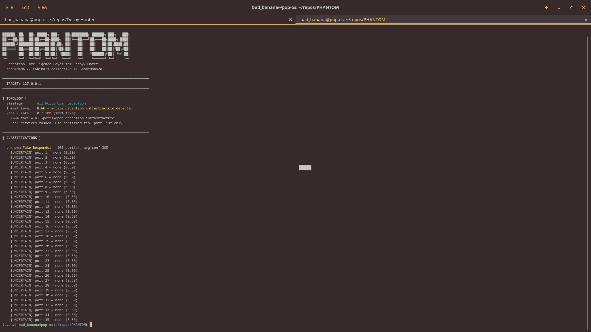

# Decoy-Hunter

[](https://github.com/GnomeMan4201/Decoy-Hunter/actions/workflows/ci.yml)
[](LICENSE)
[](#requirements)
[](https://github.com/toxy4ny/Decoy-Hunter)

**Protocol-aware service validation for networks where deception infrastructure makes every TCP port appear open.**

> Fork of [toxy4ny/Decoy-Hunter](https://github.com/toxy4ny/Decoy-Hunter) by KL3FT3Z. Original concept by [s0i37](https://github.com/s0i37/defence). Local changes in this fork are documented through Git history and should be evaluated separately from upstream behavior.

---

## Why this exists

Port-level deception can make conventional scanners report an unrealistically broad attack surface by returning plausible responses across large port ranges. Decoy-Hunter goes one layer deeper: it sends service-specific probes and evaluates whether the response behaves like the protocol that should actually be listening there.

The result is a narrower, evidence-driven view of likely real services instead of treating every open-looking socket as equally trustworthy.

---

## How it works

1. Accept a target authorized for assessment.
2. Load a local `nmap-service-probes` database.
3. Probe candidate services with protocol-aware request data.
4. Compare returned behavior with expected service characteristics.
5. Separate likely authentic services from generic deception responders.
6. Surface the reduced set for follow-up investigation.

This is a validation layer, not a replacement for broader reconnaissance. Its useful signal is the difference between *a port answering* and *a service behaving like the protocol it claims to be*.

---

## Quick start

### Requirements

- Python 3.10+
- Linux recommended
- nmap, for the local `nmap-service-probes` database
- network access to the authorized target

On Debian/Ubuntu-family systems:

```bash
sudo apt install nmap
```

### Install

```bash
git clone https://github.com/GnomeMan4201/Decoy-Hunter.git
cd Decoy-Hunter
python3 -m venv .venv
source .venv/bin/activate
python -m pip install --upgrade pip
pip install -r requirements.txt
```

### Verify the checkout

```bash
python -m py_compile decoy_hunter.py
python decoy_hunter.py --help
```

The GitHub Actions workflow verifies compilation, CLI startup, import safety, deterministic port parsing, and fail-closed probe-file resolution. If pytest tests are present, CI runs those as an additional gate. A green badge means those configured checks passed for that revision; it is not evidence of live-target classification accuracy.

---

## Usage

```bash
python3 decoy_hunter.py <target>
```

By default, the CLI looks for `nmap-service-probes` in:

```text
./nmap-service-probes
/usr/share/nmap/nmap-service-probes
/usr/local/share/nmap/nmap-service-probes
```

Use an explicit database when needed:

```bash
python3 decoy_hunter.py <target> --probe-file /path/to/nmap-service-probes
```

Custom port examples:

```bash
python3 decoy_hunter.py 192.0.2.10 -p 22,80,443
python3 decoy_hunter.py 192.0.2.10 -p 1-1024 -sU
```

Network behavior, middleboxes, rate limiting, and deception products can all affect results, so treat classifications as evidence for follow-up rather than absolute attribution.

---

## Upstream and attribution

This repository builds on prior work rather than presenting the technique as original to this fork:

- upstream fork source: [toxy4ny/Decoy-Hunter](https://github.com/toxy4ny/Decoy-Hunter)
- original defensive-deception concept: [s0i37/defence](https://github.com/s0i37/defence)

Local additions should be evaluated separately from upstream behavior when comparing results or reporting bugs.

---

## Demo

<p align="center">
  
</p>

---

## Scope

Decoy-Hunter is intended for authorized security research, defensive validation, lab work, and red-team assessments where deception infrastructure is part of the environment. It does not establish that a discovered service is exploitable, vulnerable, or owned by a particular actor; it helps determine whether a service response appears materially more authentic than surrounding decoy noise.

---

*Decoy-Hunter // badBANANA research // GnomeMan4201*
